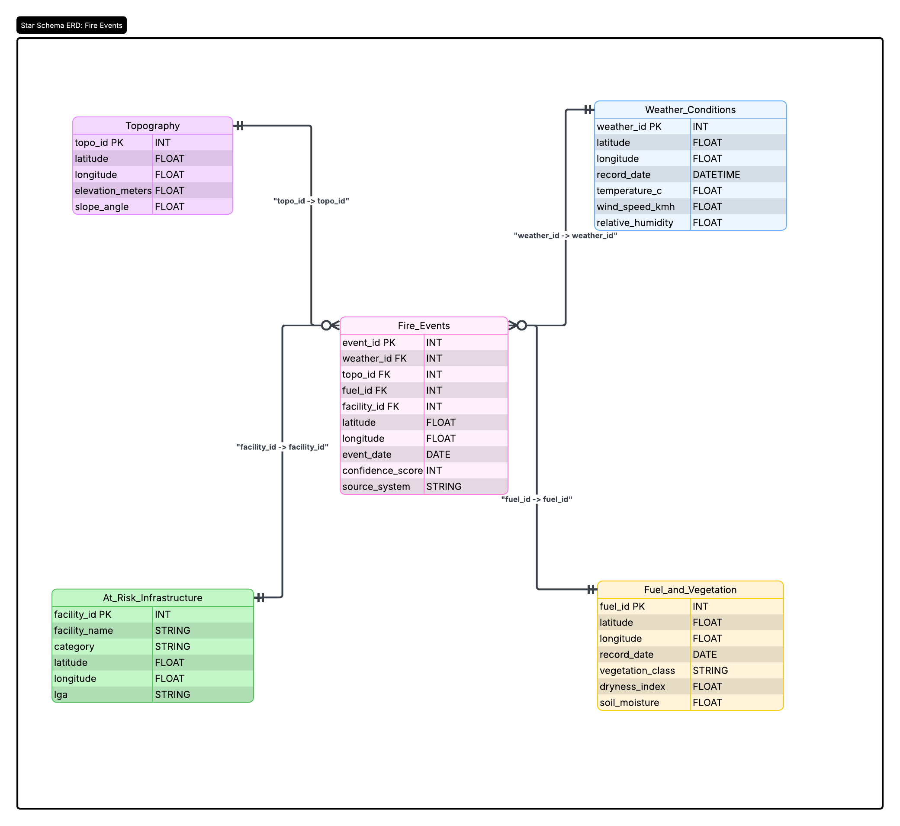

# FireFusion Database Architecture

## Overview

This document outlines the database architecture for the FireFusion bushfire forecasting model. To ensure all data pipelines connect seamlessly, we are using a Star Schema design. This approach places the main event we are predicting (the bushfire) in the center, surrounded by the tables containing the environmental and human factors.

This schema serves as the single source of truth for our data engineering phase. All extraction and transformation scripts should aim to format their final outputs to match these table structures and column names.

## The Star Schema Design

## 1. The Central Fact Table

This is the core of our database, recording the actual occurrences of fires. This acts as the target variable for our machine learning model.

### Table: Fire_Events

| Column | Type | Description |
|--------|------|-------------|
| `event_id` | Integer (PK) | Primary Key |
| `weather_id` | Integer (FK) | Foreign Key |
| `topo_id` | Integer (FK) | Foreign Key |
| `fuel_id` | Integer (FK) | Foreign Key |
| `facility_id` | Integer (FK) | Foreign Key |
| `latitude` | Float | |
| `longitude` | Float | |
| `event_date` | Date | |
| `confidence_score` | Integer | Detection certainty from satellite data |
| `source_system` | String | The origin of the record (e.g., NASA FIRMS, DEA) |

## 2. The Dimension Tables (The Predictors)

These tables surround the Fact Table and contain the features our AI will use to learn fire behavior.

### Table: Weather_Conditions

| Column | Type | Description |
|--------|------|-------------|
| `weather_id` | Integer (PK) | Primary Key |
| `latitude` | Float | |
| `longitude` | Float | |
| `record_date` | Datetime | |
| `temperature_c` | Float | |
| `wind_speed_kmh` | Float | |
| `relative_humidity` | Float | |

### Table: Topography

| Column | Type | Description |
|--------|------|-------------|
| `topo_id` | Integer (PK) | Primary Key |
| `latitude` | Float | |
| `longitude` | Float | |
| `elevation_meters` | Float | Land height from ELVIS data |
| `slope_angle` | Float | Steepness of the terrain |

### Table: Fuel_and_Vegetation

| Column | Type | Description |
|--------|------|-------------|
| `fuel_id` | Integer (PK) | Primary Key |
| `latitude` | Float | |
| `longitude` | Float | |
| `record_date` | Date | |
| `vegetation_class` | String | Type of vegetation from NVIS data |
| `dryness_index` | Float | Vegetation health/dryness |
| `soil_moisture` | Float | Ground wetness |

## 3. The Impact Table

This table maps the human infrastructure at risk, specifically focusing on the educational facilities pipeline.

### Table: At_Risk_Infrastructure

| Column | Type | Description |
|--------|------|-------------|
| `facility_id` | Integer (PK) | Primary Key |
| `facility_name` | String | |
| `category` | String | Risk category (e.g., CAT 3, CAT 4) |
| `latitude` | Float | |
| `longitude` | Float | |
| `lga` | String | Local Government Area |

## Notes for the Data Team

When writing your Python extraction scripts, please ensure your final output columns match the names and data types listed above. This will allow us to join all the datasets easily using the Foreign Keys when it is time to train the forecasting model.