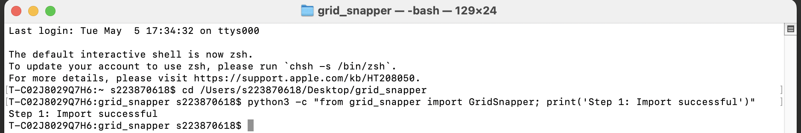
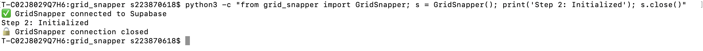
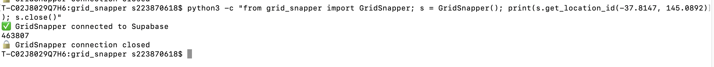
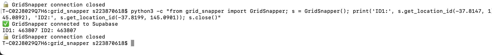
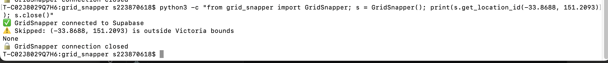

# Grid Snapper Tutorial

This guide shows you how to use Grid Snapper step by step.

## Prerequisites

```bash
pip install psycopg2-binary python-dotenv
```

## Setup

Create a `.env` file in the grid_snapper folder:

```
DB_HOST=aws-1-ap-south-1.pooler.supabase.com
DB_USER=postgres.zbgxliqmanojoknnetec
DB_PASSWORD=your_database_password
DB_PORT=5432
DB_NAME=postgres
```

## Step 1: Import Grid Snapper

```bash
python3 -c "from grid_snapper import GridSnapper; print('Step 1: Import successful')"
```

Expected output:
```
Step 1: Import successful
```



---

## Step 2: Initialize Grid Snapper

```bash
python3 -c "from grid_snapper import GridSnapper; s = GridSnapper(); print('Step 2: Initialized'); s.close()"
```

Expected output:
```
GridSnapper connected to Supabase
Step 2: Initialized
GridSnapper connection closed
```



---

## Step 3: Test Valid Victorian Coordinate

```bash
python3 -c "from grid_snapper import GridSnapper; s = GridSnapper(); print(s.get_location_id(-37.8147, 145.0892)); s.close()"
```

This snaps the coordinate (-37.8147, 145.0892) to the grid and returns its location_id.

Expected output:
```
GridSnapper connected to Supabase
463807
GridSnapper connection closed
```



---

## Step 4: Test Same Grid Cell

```bash
python3 -c "from grid_snapper import GridSnapper; s = GridSnapper(); print('ID1:', s.get_location_id(-37.8147, 145.0892), 'ID2:', s.get_location_id(-37.8199, 145.0901)); s.close()"
```

Two slightly different coordinates snap to the same grid cell and return the same location_id.

Expected output:
```
GridSnapper connected to Supabase
ID1: 463807 ID2: 463807
GridSnapper connection closed
```



---

## Step 5: Test Outside Victoria

```bash
python3 -c "from grid_snapper import GridSnapper; s = GridSnapper(); print(s.get_location_id(-33.8688, 151.2093)); s.close()"
```

Coordinates outside Victoria (like Sydney) are rejected and return None.

Expected output:
```
GridSnapper connected to Supabase
Skipped: (-33.8688, 151.2093) is outside Victoria bounds
None
GridSnapper connection closed
```



---

## How It Works

1. Input raw coordinate (latitude, longitude)
2. Validate: Is it inside Victoria?
3. Snap: Round to nearest 0.1 degree grid
4. Lookup: Check if this snapped coordinate exists in Location_Registry
5. Get or Create: Return location_id or create new one

---

## Using in Your Pipeline

```python
from grid_snapper import GridSnapper

snapper = GridSnapper()

for record in your_data:
    location_id = snapper.get_location_id(
        record['latitude'],
        record['longitude']
    )
    
    if location_id is None:
        continue  # Skip if outside Victoria
    
    # Insert to database
    insert_record(location_id, record)

snapper.close()
```

---

## Important Notes

- Always close the connection when done: snapper.close()
- Check for None before using location_id
- Preserve original coordinates in your database
- Grid snapper creates location_id for joining, not for replacing raw data

---

